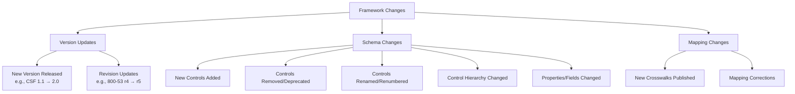
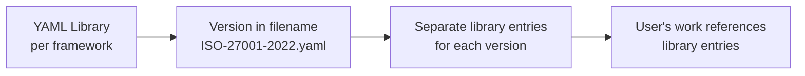
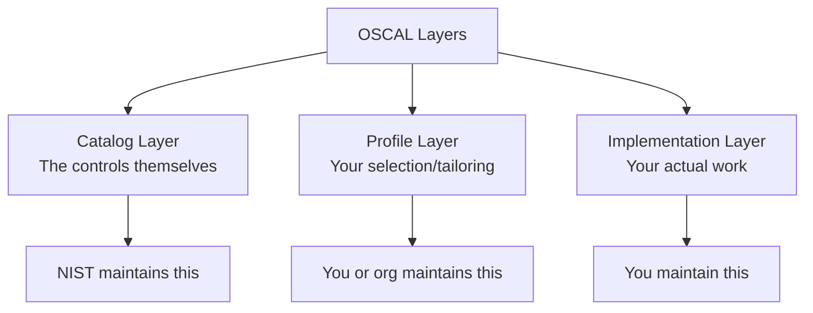
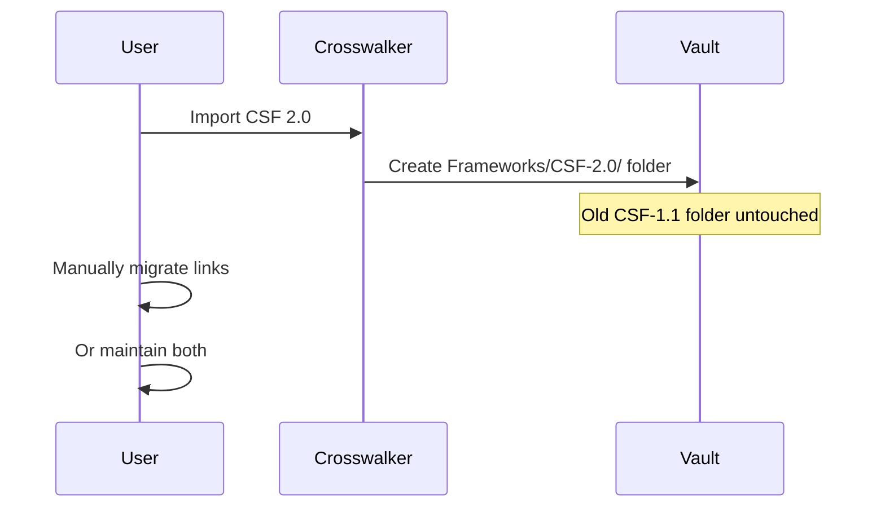
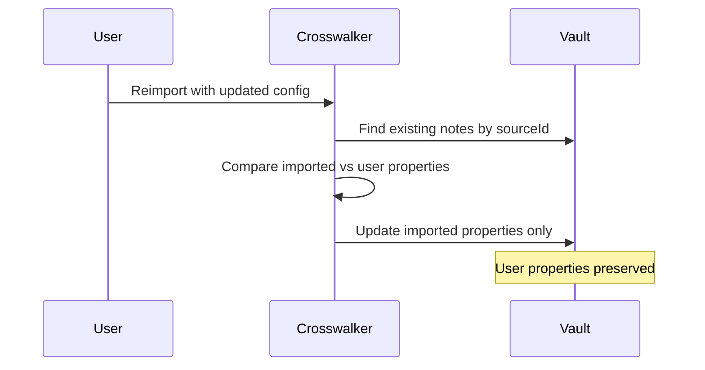
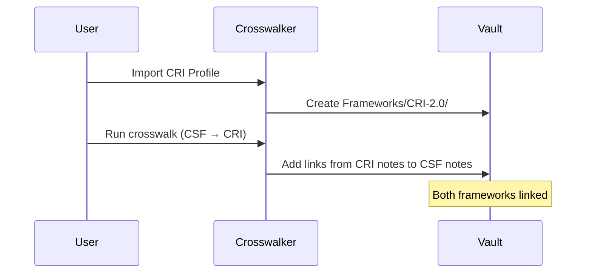

# Framework Maintenance Landscape

> **Status**: Research Summary
> **Created**: 2025-12-08
> **Source**: Synthesized from cyberbase research + external sources
> **Purpose**: Understand how frameworks change and how tools handle it

---

## What Can Change in a Framework?



### 1. Version Updates (Major)
- **Example**: NIST CSF 1.1 → CSF 2.0
- **What changes**: Structure, terminology, control numbering, entire categories
- **How handled**: Treat as **separate framework**, import to new folder
- **User action**: Manually migrate or maintain both versions

### 2. Revision Updates (Minor)
- **Example**: NIST 800-53 Rev 4 → Rev 5
- **What changes**: Some controls added/removed, descriptions updated
- **How handled**: Could be in-place update OR new folder depending on scope
- **User action**: Review diff, decide approach

### 3. Schema Changes (Within Version)
- **Example**: NIST adds a new property to controls
- **What changes**: The fields/columns in the source data
- **How handled**: Update import config, reimport (skip or merge)
- **User action**: Update config if you want new fields

### 4. Mapping Changes
- **Example**: New official crosswalk between CIS v8 and NIST CSF 2.0
- **What changes**: How controls relate across frameworks
- **How handled**: Import new mapping, add links
- **User action**: Run crosswalk import

---

## How Existing Tools Handle This

### CISO Assistant



**Key Design Decisions**:
1. Each framework version = separate YAML file
2. User's assessments are **linked to** framework entries, not embedded
3. Mappings between frameworks stored as relationship data
4. Uses NIST OLIR standard for crosswalks
5. Tool maintainers update libraries; users just reference them

**Source**: [CISO Assistant GitHub](https://github.com/intuitem/ciso-assistant-community)

### OSCAL (NIST Standard)



**Key Design Decisions**:
1. **Semantic versioning**: MAJOR.MINOR.PATCH
2. **Layer separation**: Your work is a separate layer from control definitions
3. **Schema evolution**: Old content remains valid until explicitly migrated
4. **Machine-readable**: XML/JSON/YAML with formal schemas

**Source**: [NIST OSCAL](https://pages.nist.gov/OSCAL/), [OSCAL Versioning](https://github.com/usnistgov/OSCAL/blob/main/versioning-and-branching.md)

### NIST OLIR (Mapping Standard)

**Three relationship types for crosswalks**:
1. **Concept Crosswalk**: "These are related" (no details)
2. **Set Theory Mapping**: Subset/superset/equivalent relationships
3. **Supportive Mapping**: "X supports Y" with directionality

**Key insight**: Mappings are **separate artifacts** from the frameworks themselves. A framework update doesn't automatically update mappings.

**Source**: [NIST OLIR Program](https://csrc.nist.gov/projects/olir)

---

## Migration Scenarios Visualized

### Scenario A: New Framework Version (e.g., CSF 1.1 → 2.0)



**Why this approach**: Major versions often have incompatible changes. Side-by-side is safest.

### Scenario B: In-Place Property Update



**Why this works**: `_crosswalker.importedProperties` tracks what we created vs what user added.

### Scenario C: Cross-Framework Migration (CSF → CRI)



**Why this approach**: CRI isn't a "migration" - it's a separate framework that maps TO CSF. You keep both.

---

## What Crosswalker Needs to Track

### In Each Generated Note (`_crosswalker`)

```yaml
_crosswalker:
  # Identity
  sourceId: "AC-1"                    # The ID from source data
  frameworkId: "nist-800-53-r5"       # Which framework
  frameworkVersion: "5.1.1"           # Version if applicable

  # Import tracking
  importId: "import_20241208_abc"     # Which import created this
  configId: "config_nist_001"         # Which config used
  configVersion: 1                    # Config schema version
  importedAt: "2024-12-08T12:00:00Z"

  # Property tracking (enables in-place updates)
  importedProperties:
    - control_id
    - control_name
    - description
    - family

  # Optional: Source location for debugging
  sourceFile: "nist-800-53-r5.csv"
  sourceRow: 42
```

### In Import Configs

```yaml
schemaVersion: 1
outputSchemaVersion: 1  # Bump when generated note structure changes
frameworkMeta:
  id: "nist-800-53-r5"
  name: "NIST SP 800-53 Rev 5"
  publisher: "NIST"
  version: "5.1.1"
  sourceUrl: "https://..."
```

---

## Design Decisions for Crosswalker

| Question | Decision | Rationale |
|----------|----------|-----------|
| Major version updates | New folder (side-by-side) | Too risky to merge incompatible structures |
| Minor updates (same version) | In-place with property tracking | Track what's imported vs user-added |
| Cross-framework migration | Not migration - it's linking | CRI maps TO CSF, doesn't replace it |
| User custom properties | Preserved on reimport | `importedProperties` list tells us what's ours |
| Crosswalk/mapping data | Stored as links, not embedded | Links are their own data, easy to update |
| Who maintains configs | Community + user | We can ship common ones, users can create their own |

---

## Implications for Generation Engine

### Must Have (MVP)
1. Include `_crosswalker` metadata block
2. Track `importedProperties` list
3. Use `sourceId` as canonical identifier
4. Default to "skip existing" behavior
5. Store `frameworkId` for future cross-framework features

### Should Have (v1.1)
1. Detect existing notes before import
2. Show which properties are imported vs user-added
3. In-place update option (update imported properties only)
4. Diff preview before update

### Nice to Have (v2.0)
1. Crosswalk import (add links between frameworks)
2. Version comparison (CSF 1.1 vs 2.0)
3. Migration wizard for major version updates
4. OSCAL export

---

## References

### From Your Research (cyberbase)
- Framework Mapping workflows with Obsidian, OneNote, CSV
- OSCAL integration patterns
- Bidirectional linking strategies
- Database-wiki hybrid approaches

### External Sources
- [CISO Assistant](https://github.com/intuitem/ciso-assistant-community) - YAML library approach
- [NIST OSCAL](https://pages.nist.gov/OSCAL/) - Layered model, semantic versioning
- [OSCAL Versioning](https://github.com/usnistgov/OSCAL/blob/main/versioning-and-branching.md)
- [NIST OLIR](https://csrc.nist.gov/projects/olir) - Framework mapping standard
- [CIS Controls OSCAL](https://www.cisecurity.org/insights/blog/introducing-the-cis-controls-oscal-repository)

---

## Key Takeaways

1. **Separation of concerns is crucial**: Framework data, your selection/profile, your implementation work - these are different layers
2. **Major versions = side-by-side**: Don't try to migrate incompatible structures in place
3. **Track what you imported**: `importedProperties` enables safe in-place updates
4. **Crosswalks are links, not migrations**: CRI to CSF isn't "migrating" - it's relating
5. **Canonical IDs are essential**: `sourceId` lets us match notes across reimports
6. **Community can maintain configs**: Like CISO Assistant's YAML libraries

---

*This document should be updated as we learn more about real-world usage patterns.*
