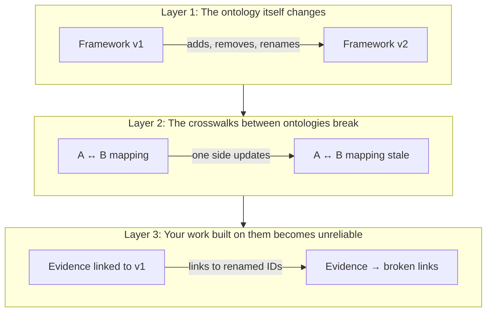
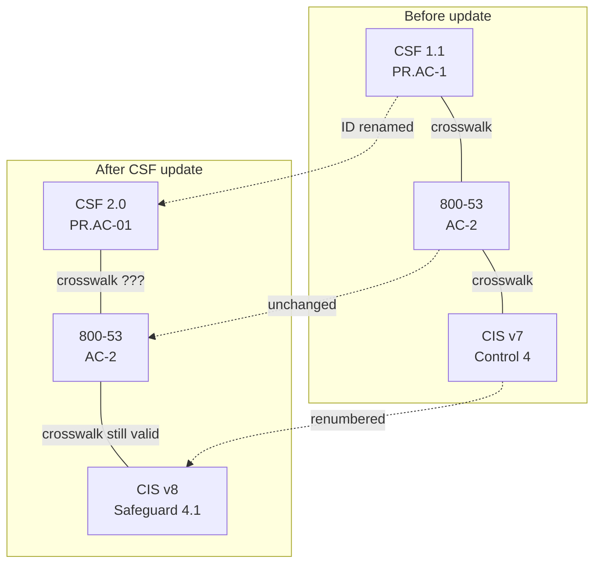
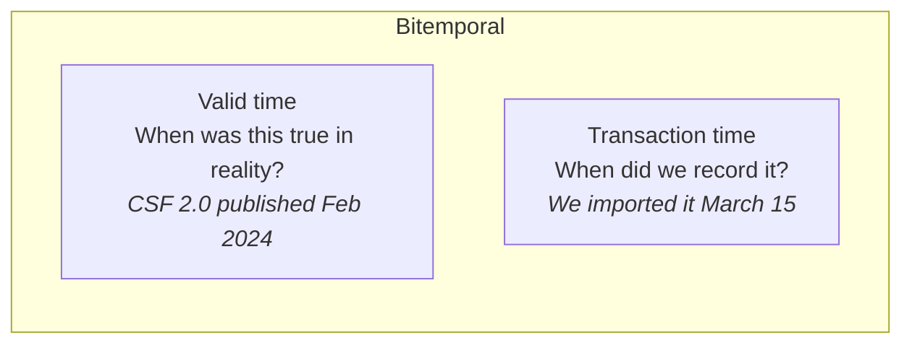
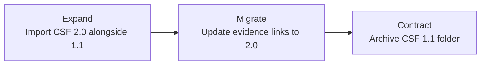

## The problem in one picture

```mermaid
graph TD
    subgraph 2023
        A1[NIST CSF 1.1] --- B1[Your evidence links]
        A1 --- C1[CIS v7 crosswalk]
    end
    subgraph 2024
        A2[NIST CSF 2.0] --- B2[Your evidence links (broken?)]
        A2 --- C2[CIS v8 crosswalk (stale?)]
    end
    A1 -->|NIST publishes update| A2
    B1 -.->|Do these still work?| B2
    C1 -.->|Is this still valid?| C2
```

NIST publishes CSF 2.0. Suddenly:
- Your evidence links to CSF 1.1 controls might point to renamed/restructured concepts
- Your crosswalk to CIS v7 is now doubly stale (both sides updated)
- Your compliance posture documentation references a retired version

**This is ontology evolution** — the things you built your knowledge on have changed underneath you.

## The three layers of the problem



### Layer 1: The ontology changes

Real examples of what frameworks actually do when they update:

```mermaid
graph LR
    subgraph NIST CSF 1.1 → 2.0
        direction TB
        N1[5 Functions<br>(Identify, Protect, Detect, Respond, Recover)]
        N2[6 Functions<br>(+ GOVERN)]
        N1 -->|Added entirely new function| N2
    end
```

```mermaid
graph LR
    subgraph MITRE ATT&CK sub-technique migration (2020)
        direction TB
        M1[T1086<br>PowerShell]
        M2[T1059.001<br>Command and Scripting: PowerShell]
        M1 -->|ID changed, nested under parent| M2
    end
```

```mermaid
graph LR
    subgraph CIS v7 → v8
        direction TB
        C1[20 Controls]
        C2[18 Controls<br>(consolidated)]
        C1 -->|Controls merged and renumbered| C2
    end
```

Each framework evolves differently:

| Framework | What changes | How it changes | How often | Machine-readable? |
|-----------|-------------|---------------|-----------|-------------------|
| [NIST CSF](/crosswalker/concepts/framework-versioning/#nist-csf-11--20-february-2024) | Added GOVERN function, restructured subcategories | Major version, Excel crosswalk provided | ~5-10 years | Excel only |
| [NIST 800-53](/crosswalker/concepts/framework-versioning/#nist-800-53-rev-4--5-september-2020) | Added 65 controls, 2 new families (PT, SR) | Major revision, comparison workbook | ~5-10 years | Excel only |
| [MITRE ATT&CK](/crosswalker/concepts/framework-versioning/#mitre-attck--the-gold-standard) | Techniques added/deprecated/revoked | Biannual, [STIX 2.1](https://oasis-open.github.io/cti-documentation/stix/intro.html) JSON changelogs | Every 6 months | Yes (STIX JSON) |
| CIS Controls | Safeguards consolidated, renumbered | Major version, no automated migration | ~3-4 years | No |
| [CRI Profile](/crosswalker/concepts/framework-versioning/#cri-profile) | Diagnostic statements updated, mappings separated | Ad-hoc, mapping workbook | ~1-2 years | Excel only |

### Layer 2: Crosswalks break

When Framework A updates but the A↔B crosswalk doesn't, every link through that crosswalk is suspect.



The crosswalk from CSF 1.1 → 800-53 was maintained by [NIST OLIR](https://csrc.nist.gov/projects/olir). But OLIR is **submission-based** — someone has to manually update it. There's no automatic staleness detection. See [crosswalk staleness](/crosswalker/agent-context/framework-crosswalks/#crosswalk-staleness).

**The pivot/interlingua solution**: [SCF's STRM](https://securecontrolsframework.com/set-theory-relationship-mapping-strm/) maps 175+ frameworks through one central hub. When one framework updates, only one mapping needs updating. See [schema matching](/crosswalker/concepts/schema-matching/#the-interlingua--pivot-approach).

### Layer 3: Your work breaks

```mermaid
graph TD
    subgraph Your vault
        E[MFA-Policy.md<br>evidence note]
        E -->|implements:: [[AC-2]]| AC2[AC-2.md<br>NIST 800-53]
        E -->|satisfies:: [[PR.AC-1]]| PR[PR.AC-1.md<br>CSF 1.1]
    end
    subgraph After CSF 2.0 import
        PR2[PR.AC-01.md<br>CSF 2.0]
    end
    PR -.->|PR.AC-1 renamed to PR.AC-01<br>Your link is now broken| PR2
```

Your [evidence mapping](/crosswalker/getting-started/grc-teams/) work — the hours spent linking policies to controls — is at risk every time a framework updates.

## The actors: who owns what

The ontology evolution problem involves distinct entities with different roles, incentives, and timelines:

```mermaid
graph TD
    subgraph Framework Owners
        NIST[NIST<br><i>publishes 800-53, CSF, OSCAL</i>]
        MITRE[MITRE<br><i>publishes ATT&CK, D3FEND, ENGAGE</i>]
        CIS[CIS<br><i>publishes Controls, Benchmarks</i>]
        CRI_ORG[CRI<br><i>publishes CRI Profile</i>]
    end
    subgraph Mapping Maintainers
        OLIR[NIST OLIR<br><i>submission-based crosswalks</i>]
        SCF_ORG[SCF<br><i>175+ framework hub via STRM</i>]
        CTID[Center for Threat-<br>Informed Defense<br><i>ATT&CK ↔ 800-53 mappings</i>]
        COMMUNITY[Community<br><i>ad-hoc mappings in Excel/CSV</i>]
    end
    subgraph Consumers (you)
        GRC[GRC Team<br><i>must prove compliance</i>]
        SEC[Security Team<br><i>maps controls to detections</i>]
        AUDIT[Auditors<br><i>verify evidence → controls</i>]
    end
    NIST -->|publishes framework| OLIR
    MITRE -->|publishes framework| CTID
    OLIR -->|provides crosswalks| GRC
    SCF_ORG -->|provides meta-mappings| GRC
    CTID -->|provides mappings| SEC
    GRC -->|proves compliance to| AUDIT
```

### The timing problem

Each actor operates on a different timeline:

| Actor | Update cadence | Your notification |
|-------|---------------|-------------------|
| **NIST** (framework owner) | Every 5-10 years | Federal Register notice, months of public comment |
| **MITRE** (framework owner) | Every 6 months | Blog post, STIX JSON changelog |
| **OLIR** (mapping maintainer) | When someone submits an update | No notification — you discover staleness yourself |
| **SCF** (mapping hub) | When a framework they track updates | Release notes on their site |
| **Your GRC team** (consumer) | Continuous — evidence links added daily | You need to know when YOUR imported snapshot is stale |

**The gap Crosswalker fills**: No existing tool watches all these actors and tells you "your imported NIST 800-53 is now outdated, here's what changed, and here's which of your evidence links are affected."

### The relationship types

```mermaid
graph LR
    subgraph Ownership
        O[Framework Owner] -->|publishes, versions| F[Framework]
    end
    subgraph Mapping
        F1[Framework A] ---|crosswalk<br>(maintained by someone)| F2[Framework B]
    end
    subgraph Consumption
        U[Your Team] -->|imports, links evidence to| F
        U -->|uses crosswalk between| F1
        U -->|uses crosswalk between| F2
    end
```

Three distinct relationship types, each with different staleness risks:
1. **Ownership**: Framework owner → framework. Stable until they publish an update.
2. **Mapping**: Maintained by a THIRD PARTY (OLIR, SCF, or community). Can go stale independently of either framework.
3. **Consumption**: YOUR work linking evidence to controls. At risk whenever ownership OR mapping changes.

### What this means for Crosswalker

The [EvolutionPattern taxonomy](/crosswalker/reference/roadmap/#foundation--get-the-architecture-right) needs to track not just how a framework changes, but:
- **Who maintains it** (and how responsive they are to updates)
- **Who maintains the crosswalks** (OLIR? SCF? community? unmaintained?)
- **What notification mechanisms exist** (STIX JSON? Excel diff? nothing?)
- **What's your exposure** (how many of your evidence links touch this framework?)

These are the [progressive classification](/crosswalker/agent-context/zz-log/2026-04-03-vision-alignment-decisions/#1-meta-layer-ux-progressive-classification) inputs — community pre-classified profiles capture this institutional knowledge so individual users don't have to research it.

## How to handle it: Slowly Changing Dimensions

The data warehouse community solved this decades ago with [Slowly Changing Dimensions](https://en.wikipedia.org/wiki/Slowly_changing_dimension) (SCD). These patterns apply directly:

```mermaid
graph TD
    subgraph Type 1: Overwrite
        T1A[Import CSF 2.0] --> T1B[Delete CSF 1.1 folder]
        T1B --> T1C[Evidence links → broken]
    end
    subgraph Type 2: Keep history
        T2A[Import CSF 2.0] --> T2B[Keep CSF 1.1 folder too]
        T2B --> T2C[Both versions coexist]
    end
    subgraph Type 3: Alias
        T3A[Import CSF 2.0] --> T3B[PR.AC-01.md gets<br>aliases: [PR.AC-1]]
        T3B --> T3C[Old links still resolve]
    end
```

| SCD Type | What happens | When to use | [Crosswalker implementation](/crosswalker/agent-context/data-model-resilience/) |
|----------|-------------|-------------|------------------------------|
| **Type 1** (overwrite) | Delete old, import new | Framework barely changed (patch/typo fix) | Simple re-import |
| **Type 2** (keep history) | Both versions coexist in separate folders | Major version change | Version-tagged import folders |
| **Type 3** (alias) | New notes have `aliases` pointing to old IDs | IDs renamed but concept unchanged | `_crosswalker.previous_ids` in frontmatter |
| **Type 6** (hybrid) | History + alias + current flag | Most complete handling | Full [metadata tiers](/crosswalker/agent-context/constraint-enforcement/#metadata-tiers) |

**Crosswalker's default**: Type 2 (version-tagged folders) + Type 3 (ID aliasing) — keep history, maintain link continuity.

## The temporal dimension

When multiple versions coexist, you need to track WHEN:



Crosswalker's [`_crosswalker` metadata](/crosswalker/agent-context/constraint-enforcement/#metadata-tiers) tracks transaction time today (`import_date`). Adding `framework_version` and `framework_date` enables bitemporal queries: "show me our compliance posture as of date X against framework version Y."

## The translation analogy

[Crosswalking](/crosswalker/agent-context/framework-crosswalks/) is structurally like language translation:

```mermaid
graph TD
    subgraph Direct translation (N² problem)
        NIST[NIST] ---|mapping| CIS[CIS]
        NIST ---|mapping| MITRE[MITRE]
        CIS ---|mapping| MITRE
        NIST ---|mapping| CRI[CRI]
        CIS ---|mapping| CRI
        MITRE ---|mapping| CRI
    end
    subgraph Pivot/interlingua (N problem)
        N2[NIST] --- SCF[SCF<br>(pivot)]
        C2[CIS] --- SCF
        M2[MITRE] --- SCF
        CR2[CRI] --- SCF
    end
```

The [SCF STRM approach](https://securecontrolsframework.com/set-theory-relationship-mapping-strm/) is the interlingua — map each framework to SCF once, get crosswalks to all 175+ others. When a framework updates, only one mapping needs maintaining.

## Formal models

### SKOS — the natural fit

[SKOS (Simple Knowledge Organization System)](https://www.w3.org/TR/skos-reference/) maps directly to Crosswalker's domain:

| SKOS | Crosswalker | Example |
|------|-------------|---------|
| `ConceptScheme` | A framework | NIST CSF 2.0 |
| `Concept` | A control/technique | AC-2, T1078 |
| `broader`/`narrower` | Hierarchy | Family → Control → Enhancement |
| `exactMatch` | Exact crosswalk | CSF PR.AC-01 = 800-53 AC-2 |
| `broadMatch` | Partial crosswalk | CIS 6.3 broadly covers AC-2 |

SKOS has a versioning gap (no built-in version tracking). [skos-history](https://github.com/zbw/skos-history) partially addresses this.

### SSSOM — mappings as data

[SSSOM](https://mapping-commons.github.io/sssom/) represents crosswalk mappings as TSV/CSV with standardized columns — essentially what Crosswalker imports and exports. A natural export format.

### SchemaVer — versioning for data

Where [SemVer](https://semver.org/) tracks API compatibility, [SchemaVer](https://docs.snowplow.io/docs/pipeline-components-and-applications/iglu/common-architecture/schemaver/) tracks data compatibility:

| Component | Question | Framework example |
|-----------|----------|-------------------|
| **MODEL** | Can old data work with new schema? | ATT&CK sub-technique migration: **no** (IDs changed) |
| **REVISION** | Can new data work with old schema? | CSF adding GOVERN: **no** (new function) |
| **ADDITION** | Non-breaking additive change? | CIS fixing a typo: **yes** |

### Expand-Migrate-Contract

Zero-downtime migration pattern from databases:



## LLM-based matching

Recent [OAEI](http://oaei.ontologymatching.org/) evaluations show LLM systems achieving 0.83-0.95 F1 on ontology matching benchmarks. Future: Crosswalker could use LLMs to *suggest* crosswalk mappings between arbitrary frameworks. See [schema matching](/crosswalker/concepts/schema-matching/).

## What Crosswalker does about all this

The [ontology lifecycle](/crosswalker/concepts/ontology-lifecycle/) — specifically the **Maintain** phase — is where Crosswalker addresses evolution:

- **[EvolutionPattern taxonomy](/crosswalker/reference/roadmap/#foundation--get-the-architecture-right)** — classify how each ontology evolves (the spec being designed now)
- **[Migration strategy engine](/crosswalker/agent-context/data-model-resilience/)** — given evolution pattern → recommended SCD type
- **[Metadata tiers](/crosswalker/agent-context/constraint-enforcement/#metadata-tiers)** — progressive `_crosswalker` enrichment for version tracking
- **[Constraint enforcement](/crosswalker/agent-context/constraint-enforcement/)** — detect stale crosswalks, orphaned links, broken references

---

## Resources

### Standards
- [NIST IR 8477](https://csrc.nist.gov/pubs/ir/8477/final) — Mapping Relationships Between Documentary Standards
- [OWL 2](https://www.w3.org/TR/owl2-overview/) — `owl:priorVersion`, `owl:backwardCompatibleWith`, `owl:deprecated`
- [SKOS](https://www.w3.org/TR/skos-reference/) — Simple Knowledge Organization System
- [SSSOM](https://mapping-commons.github.io/sssom/) — Simple Standard for Sharing Ontology Mappings
- [OSCAL](https://pages.nist.gov/OSCAL/) — Machine-readable security controls with SemVer
- [STIX 2.1](https://oasis-open.github.io/cti-documentation/stix/intro.html) — ATT&CK deprecation chains
- [SchemaVer](https://docs.snowplow.io/docs/pipeline-components-and-applications/iglu/common-architecture/schemaver/) — Data compatibility versioning
- [Dublin Core](https://www.dublincore.org/specifications/dublin-core/dcmi-terms/) — `dcterms:replaces` / `dcterms:isReplacedBy`

### Tools
- [Protégé](https://protege.stanford.edu/) — Ontology editor
- [OAEI](http://oaei.ontologymatching.org/) — Alignment evaluation
- [LogMap](https://www.cs.ox.ac.uk/isg/tools/LogMap/) — Ontology matching
- [SCF STRM](https://securecontrolsframework.com/strm-bundle/) — Meta-framework mapping
- [skos-history](https://github.com/zbw/skos-history) — Version tracking

### Academic
- Flouris et al., "Ontology change: classification and survey" (2008)
- Noy & Klein, "Ontology Evolution: Not the Same as Schema Evolution" (2004)
- Euzenat & Shvaiko, "Ontology Matching" (2013, Springer)
- Polleres et al., "How Does Knowledge Evolve in Open Knowledge Graphs?" (2023)
- Kimball & Ross, "The Data Warehouse Toolkit" — SCD patterns

### Related pages
- [Framework versioning](/crosswalker/concepts/framework-versioning/) — how each framework handles updates
- [Schema matching](/crosswalker/concepts/schema-matching/) — matching algorithms and alignment
- [Data model resilience](/crosswalker/agent-context/data-model-resilience/) — Crosswalker's handling strategies
- [Constraint enforcement](/crosswalker/agent-context/constraint-enforcement/) — integrity patterns
- [Framework crosswalks](/crosswalker/agent-context/framework-crosswalks/) — crosswalk configuration
- [Ontology lifecycle](/crosswalker/concepts/ontology-lifecycle/) — the full lifecycle model
- [Terminology](/crosswalker/concepts/terminology/) — definitions for all terms used here
