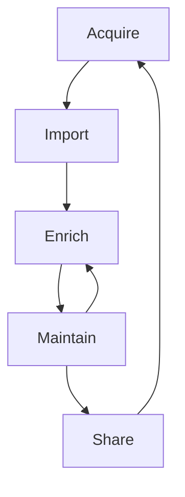

## What happens to an ontology in Crosswalker

An ontology (framework, taxonomy, any structured knowledge system) goes through five lifecycle phases within the Crosswalker ecosystem. This isn't a one-shot pipeline — it's an ongoing lifecycle where ontologies are acquired, imported, enriched with evidence and crosswalks, maintained as they evolve, and shared with the community.

| Phase | What happens | Current state |
|-------|-------------|---------------|
| [Acquire](#acquire) | Get structured data from the outside world | CSV file picker in wizard |
| [Import](#import) | Parse, transform, generate vault structure | CSV parser + generation engine complete; transforms 0% |
| [Enrich](#enrich) | Link, crosswalk, attach evidence | Basic WikiLinks; typed links planned |
| [Maintain](#maintain) | Handle updates, detect staleness, migrate versions | Research complete; implementation planned |
| [Share](#share) | Export, report, contribute configs back | Not started |

The cycle repeats: shared configs make the next Acquire easier. Framework updates trigger Maintain, which loops back to Enrich. [Evidence mapping](/crosswalker/getting-started/grc-teams/) lives in the Enrich phase. [Ontology evolution](/crosswalker/concepts/ontology-evolution/) lives in Maintain.

---

## Acquire

**What**: Get structured data from the outside world into the system.

**Current**: File picker in the [import wizard](/crosswalker/features/import-wizard/) accepting CSV files from the local filesystem.

**Planned**:
- XLSX file selection with sheet picker
- JSON/JSONL file import
- Future: URL-based import (fetch a framework CSV from a public URL)
- Future: [OSCAL](https://pages.nist.gov/OSCAL/) catalog import (machine-readable framework format)
- Future: community config [registry](/crosswalker/agent-context/zz-log/2026-04-03-vision-alignment-decisions/#8-community-marketplace-research-item) that bundles framework data with import configs

**Decision point**: How much do we automate acquisition? The [progressive classification UX](/crosswalker/agent-context/zz-log/2026-04-03-vision-alignment-decisions/#1-meta-layer-ux-progressive-classification) starts here — known frameworks could auto-fetch their data.

---

## Import

**What**: Parse, transform, and generate — turn raw files into organized vault structure with metadata.

This phase has three sub-steps:

### Parse

Convert raw file bytes into structured data. Using established libraries — solved problems:
- [PapaParse](https://www.papaparse.com/) for CSV with streaming (files >5MB)
- `xlsx` package for Excel (installed, not yet integrated)
- Native JSON parsing (planned)
- [Column analysis](/crosswalker/features/import-wizard/) auto-detects types (hierarchy, ID, text, numeric, date, tags, URL)

### Transform

Clean, normalize, and restructure parsed data. [24 transform types defined](/crosswalker/design/transformation/) (0% implemented). [Research evaluated 14 engines](/crosswalker/agent-context/zz-log/2026-04-03-transform-engine-research/) — **custom build decided** (~2KB bundle, Obsidian-native output, under 25ms). Optional escape hatches: [Arquero](https://github.com/uwdata/arquero), [JSONata](https://jsonata.org/).

Per-framework transforms: [hierarchical forward-fill](/crosswalker/agent-context/helper-functions/#hierarchical_ffilldataframe-columns), [tag aggregation](/crosswalker/reference/framework-data-sources/#special-transform-tag-aggregation), [ID normalization](/crosswalker/reference/framework-data-sources/#assessment-procedures), [preamble extraction](/crosswalker/reference/framework-data-sources/#special-transform-preamble-extraction). See [helper functions](/crosswalker/agent-context/helper-functions/) and [ChunkyCSV research](/crosswalker/agent-context/zz-log/2026-04-03-chunkycsv-and-transformation-engines/).

### Generate

Produce folders, notes, frontmatter, and [`_crosswalker` metadata](/crosswalker/agent-context/constraint-enforcement/#metadata-tiers). The [generation engine](/crosswalker/features/generation-engine/) is **production-ready** — folder hierarchies, YAML serialization, link formatting, template resolution, path sanitization. Will evolve to support [FrameworkConfig v2](/crosswalker/agent-context/config-schema-design/) and [metadata v2 tiers](/crosswalker/agent-context/constraint-enforcement/#metadata-tiers).

---

## Enrich

**What**: Connect the imported ontology to other frameworks and to your evidence. This is the [evidence mapping](/crosswalker/getting-started/grc-teams/) phase — the core value for GRC teams.

- [Cross-framework crosswalking](/crosswalker/agent-context/framework-crosswalks/) — generate typed WikiLinks between frameworks using [matching modes](/crosswalker/agent-context/helper-functions/#match_valuesource-target-mode) (exact, array-contains, regex)
- [Typed link syntax](/crosswalker/agent-context/link-metadata-syntax-spec/) — `framework_here.implements:: [[AC-2]] {"sufficient": true}`
- [Link insertion commands](/crosswalker/agent-context/link-metadata-system/) — "Insert framework link" with search modal and metadata form
- Evidence linking — attach policies, audit findings, and technical docs to framework controls with [structured edge metadata](/crosswalker/agent-context/link-metadata-system/)

**Ecosystem note**: [Obsidian Bases](/crosswalker/concepts/metadata-ecosystem/) can query frontmatter but **cannot traverse typed links**. Edge metadata requires [DataviewJS or Datacore](/crosswalker/concepts/metadata-ecosystem/#comparison-matrix). This is a [known trade-off](/crosswalker/agent-context/link-metadata-system/#ecosystem-compatibility).

Enrichment is ongoing — you keep adding evidence links and crosswalks as your compliance posture evolves. It's not a one-time step.

---

## Maintain

**What**: Handle framework updates, version migration, [stale crosswalk detection](/crosswalker/agent-context/framework-crosswalks/#crosswalk-staleness), and long-term [data model resilience](/crosswalker/agent-context/data-model-resilience/).

This is the novel contribution — [no existing tool solves the ontology evolution meta-problem](/crosswalker/agent-context/zz-log/2026-04-03-deep-research-synthesis/#research-1-ontology-lifecycle-management--does-anything-solve-this).

- [EvolutionPattern taxonomy](/crosswalker/reference/roadmap/#foundation--get-the-architecture-right) — classify how each ontology evolves (release cadence, breaking changes, ID stability, changelog format). **Standalone spec.** [Research](/crosswalker/concepts/ontology-evolution/)
- [Migration strategy engine](/crosswalker/concepts/ontology-evolution/#how-data-warehouses-handle-this-slowly-changing-dimensions) — given old + new version → recommended [SCD type](/crosswalker/concepts/ontology-evolution/#how-data-warehouses-handle-this-slowly-changing-dimensions) + handling strategy
- [Progressive classification UX](/crosswalker/agent-context/zz-log/2026-04-03-vision-alignment-decisions/#1-meta-layer-ux-progressive-classification) — community pre-classified → guided wizard → auto-detect
- [Constraint enforcement](/crosswalker/agent-context/constraint-enforcement/) — lazy detection of orphaned notes, broken links, stale metadata

Maintain loops back to Enrich — when a framework updates, crosswalk links may need updating, and evidence mappings need re-validation.

---

## Share

**What**: Export, report, and contribute back to the community.

- Community [config registry](/crosswalker/agent-context/zz-log/2026-04-03-vision-alignment-decisions/#8-community-marketplace-research-item) — share [FrameworkConfig](/crosswalker/agent-context/config-schema-design/) files so others don't repeat the per-framework configuration work
- [OSCAL export](https://pages.nist.gov/OSCAL/) — machine-readable output for GRC tool integration
- Compliance dashboards — [Bases views](/crosswalker/concepts/metadata-ecosystem/) for gap analysis
- Report generation — exportable compliance reports for auditors
- [Spec publication](/crosswalker/reference/roadmap/#community--share-and-scale) — the EvolutionPattern taxonomy as a standalone standard

Share loops back to Acquire — community-contributed configs make the next person's import easier.

---

## Lifecycle as architecture

The lifecycle maps to the [layered architecture](/crosswalker/agent-context/zz-log/2026-04-03-layered-architecture-vision/):

| Lifecycle phase | Architecture layer | Who owns it |
|----------------|-------------------|-------------|
| Acquire | Integration (plugin/CLI) | Platform wrapper |
| Import (parse/transform/generate) | Library (SDK) | Core library + transform providers |
| Enrich | Library + Integration | Core library + Obsidian WikiLink API |
| Maintain | Spec + Library | Spec defines patterns, library implements |
| Share | Integration + Community | Plugin UI + config registry |

The [config-as-code](/crosswalker/agent-context/zz-log/2026-04-03-vision-alignment-decisions/#2-config-as-code-is-the-source-of-truth) format ([FrameworkConfig v2](/crosswalker/agent-context/config-schema-design/)) configures every phase. Community [framework drivers](/crosswalker/agent-context/zz-log/2026-04-03-layered-architecture-vision/#layer-3-integrations-framework-specific-platform-specific) are JSON configs that tell the system how to handle a specific ontology across its entire lifecycle.

---

## Resources

- [Architecture](/crosswalker/design/architecture/) — component-level system design
- [Layered architecture vision](/crosswalker/agent-context/zz-log/2026-04-03-layered-architecture-vision/) — spec → library → integrations
- [Why Obsidian, why files](/crosswalker/agent-context/zz-log/2026-04-03-why-obsidian-why-files/) — the filesystem-first decision
- [Roadmap](/crosswalker/reference/roadmap/) — which stages are being built when
- [File-based graph databases](/crosswalker/concepts/file-based-graph-database/) — what the pipeline produces
- [Consistency models](/crosswalker/concepts/consistency-models/) — how the pipeline handles failure
