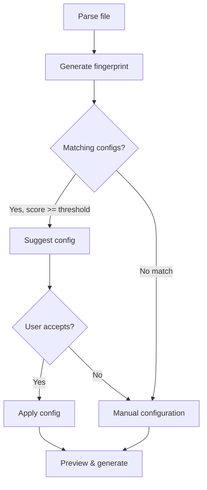

## The problem

When importing a file you've seen before (or a similar one), you shouldn't have to reconfigure columns from scratch.

## Fingerprinting

When data is parsed, Crosswalker generates a fingerprint based on:
- Column names (ordered)
- Column count
- Sample data patterns (if pattern detection is enabled)

This fingerprint is stored with each saved config.

## Matching algorithm

When a new file is imported:

1. Generate fingerprint for the new file
2. Score each saved config against the new fingerprint
3. Scoring considers:
   - **Column name overlap** — How many column names match
   - **Column count similarity** — Same number of columns
   - **Pattern similarity** — Similar data shapes (IDs, dates, URLs)
4. Configs scoring above the threshold (default: 50) are suggested

## User flow

## Settings

| Setting | Default | Description |
|---------|---------|-------------|
| `configMatchThreshold` | 50 | Minimum score to suggest |
| `enablePatternDetection` | true | Consider data patterns in matching |
| `autoApplyExactMatch` | false | Skip confirmation on 100% match |
