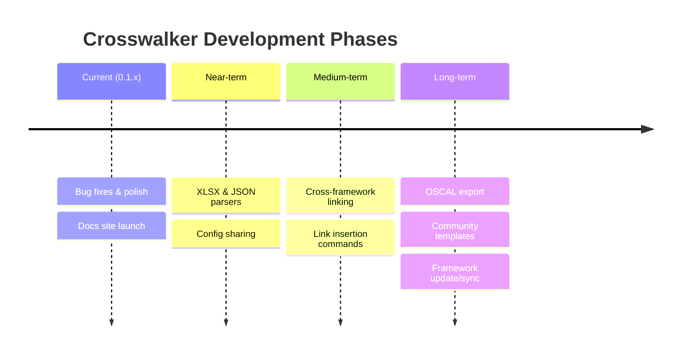

import { Card, CardGrid, Tabs, TabItem, Steps, Badge } from '@astrojs/starlight/components';

<Tabs>
  <TabItem label="Current (0.1.x)">
    **Focus**: Stabilize the MVP and launch documentation.

    <CardGrid>
      <Card title="Bug fixes & polish">
        Improve error handling, edge cases, and user feedback throughout the import wizard.
      </Card>
      <Card title="Documentation site">
        Starlight-based knowledge base with 46+ pages covering concepts, design, and agent context. **Done.**
      </Card>
      <Card title="Unit tests">
        Jest test suite with mocked Obsidian API. 14 tests passing. **Done.**
      </Card>
      <Card title="CI/CD">
        GitHub Actions for releases, unit tests, and docs deployment. **Done.**
      </Card>
    </CardGrid>
  </TabItem>

  <TabItem label="Near-term">
    **Focus**: Broader file format support and configuration sharing.

    <CardGrid>
      <Card title="XLSX parser">
        Excel file support — the `xlsx` package is installed but not yet integrated into the import wizard.
      </Card>
      <Card title="JSON parser">
        Import from JSON and JSONL files for frameworks distributed in structured data formats.
      </Card>
      <Card title="Config export/import">
        Share import configurations as `.crosswalker.json` files. See [config schema design](/Crosswalker/agent-context/config-schema-design/).
      </Card>
      <Card title="Improved preview">
        Expandable folder tree and full note preview in Step 3 of the wizard.
      </Card>
    </CardGrid>
  </TabItem>

  <TabItem label="Medium-term">
    **Focus**: The [evidence mapping](/Crosswalker/getting-started/grc-teams/) workflow — linking frameworks to each other and to your evidence.

    <CardGrid>
      <Card title="Cross-framework linking">
        Generate typed WikiLinks between imported frameworks using crosswalk data. See [framework crosswalks](/Crosswalker/agent-context/framework-crosswalks/).
      </Card>
      <Card title="Link insertion commands">
        "Insert framework link" command with search modal and metadata form. The [link metadata system](/Crosswalker/agent-context/link-metadata-system/) in action.
      </Card>
      <Card title="Autocomplete">
        Suggestions for framework references as you type in notes.
      </Card>
      <Card title="Batch re-import">
        Re-import/update existing framework folders with [version awareness](/Crosswalker/concepts/framework-versioning/) and diff preview.
      </Card>
    </CardGrid>
  </TabItem>

  <TabItem label="Long-term">
    **Focus**: Interoperability, community, and compliance reporting.

    <CardGrid>
      <Card title="OSCAL export">
        Export to [Open Security Controls Assessment Language](https://pages.nist.gov/OSCAL/) for integration with GRC tools.
      </Card>
      <Card title="Community templates">
        Shareable configs for common frameworks — `crosswalker install nist-800-53-r5`. See [config schema design](/Crosswalker/agent-context/config-schema-design/#community-sharing-model).
      </Card>
      <Card title="Framework update/sync">
        Detect upstream framework changes and apply updates with [data model resilience](/Crosswalker/agent-context/data-model-resilience/) patterns.
      </Card>
      <Card title="Compliance dashboards">
        Gap analysis reports and coverage views using [Obsidian Bases](/Crosswalker/concepts/metadata-ecosystem/).
      </Card>
    </CardGrid>
  </TabItem>

  <TabItem label="Infrastructure">
    **Focus**: Testing, distribution, and developer experience.

    <Steps>
      1. E2E testing in CI with [wdio-obsidian-service](https://github.com/jesse-r-s-hines/wdio-obsidian-service) (local setup done, CI on roadmap)
      2. Community plugin submission to the Obsidian plugin registry
      3. Automated changelog generation from conventional commits
      4. [Playwright docs tests](/Crosswalker/development/testing/) in CI for docs regression
    </Steps>
  </TabItem>
</Tabs>

---

See the full [ROADMAP.md](https://github.com/cybersader/Crosswalker/blob/main/ROADMAP.md) on GitHub.
